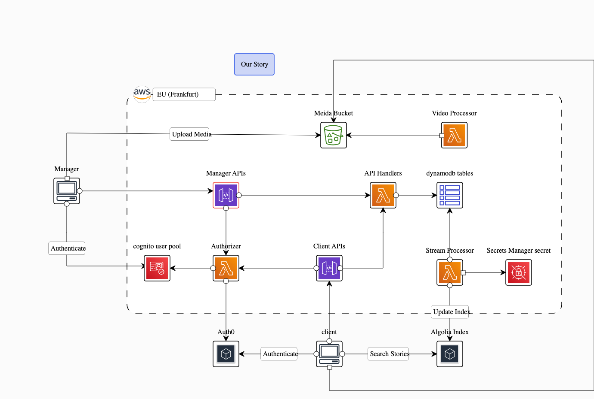

# Project definition, APIs and Model

If you haven't read the documentation in ourstory-intro, please read it first [here](https://github.com/syriail/ourstory-intro)

# System Architecture

Manager and Frontend are web applications built using React framework and they connect to backend by REST APIs.

The main focus of this section is the backend architecture since it contains the components and logic of the system.



The system consists of three main compnents:

- Backend which in turned consists of three compnents:
  - AWS Cloud services which handles authentication, provides APIs except search, and provides business logic and data and media storage.
  - Algolia search engine: Which indexes data and provides search capabilities. The Frontend communicate directly with Algolia to conduct search.
  - Auth0: To authenticate end users who use Frontend to conduct search
- Manager where the collections and stories are managed.
- Frontend where the end users conduct searches directly against Algolia. Frontend communicate with AWS component only for settings such as Tags, view media, and view story details

## API

APIs are logically divided into Manager APIs and Frontend (Client) APIs.

- Manager APIs to be called for maanging collections and stories
- Frontend APIs to be called for getting tags, story details, and media view urls and managing end users profiles.
- Frontend communicate directly with Algolia to conduct searches.

Each API is handled by a lambda function

## Authentication and Authorization

All APIs require authentication/authorization except getTag API since it is treated as settings.

There're two ways of authentication, Cognito and Auth0.

- Cognito is used to authenticate employees who are the users of Manager
- Auth0 is used to authenticate end users who are the users of Frontend

After authentication, all APIs authorization, regardless of Authenticator are handled by one lambda function named `authorize`.

The `authorize` function distinguish Cognito token from Auth0 token, and recognizes the role of the user also to provide the corresponding access permissions.

## Media Storage

All stories media are to be stored in S3 bucket.

Media files are not access publicly, and not access by an API eighther, but rather there're two APIs to provided singed URLs, one for upload and one for download/view. This way the client application can access the media file securely and more efficient.

## Syncronize with Algolia

Anytime a sotry, collection or a translation is added or modified in the DB, the changes must be reflected in Algolia indexes to keep them up-to-date.

A stream is added to the translation table since it holds the searchable data.

Also a lambda function is added to read the stream and update Algolia index

# DB Design

The expected read/write operations are very low and the very most of operations are to be triggered from Manger, so the only requirement to be met when choosing DB service is cost.

Dynamodb meets this only requirement since it is expected that read/write operations won't exceed the free tier.

Also since high speed IOs is not a requirement, so we don't need to complicate the design and follow one-table approch, rather a separate table will be provided for most of models as if a rational DB is to be designed.

## Collection Table

Key:

- id: String / HASH

Expected Attributes:

- managerId: String
- defaultLocale: String
- createdAt: String
- availableTranslations: [String]
- editors: [String]
- tags: [String]

## Story Table

Key:

- id: String / HASH
- collectionId / RANGE

Expected Attributes:

- defaultLocale: String
- storyType: [String]
- storyTellerAge: Int
- storyTellerGender: String
- availableTranslations: [String]
- mediaFiles: List of map {format, mediaPath}

## TagValue Table

Key:

- storyId: String / HASH
- tagId: String /RANGE
  tagId is in the form of locale#slug

Expected Attributes:

- collectionId: String
- name: String
- value: String

## Translation Table

Key:

- id: String / HASH
  id is the id of the item to be translated, such as projectId or storyId
- locale: String / RANGE

Possible Attributes: _Depending on what item to be translated_

- translatedType: String
- collectionName: String
- collectionDescription: String
- tagName: String
- storyTitle: String
- storyAbstraction: String
- storyTranscript: String
- storyTellerName: String
- storyTellerPlaceOfOrigin: String
- storyTellerResidency: String
- collectorName: String

# Testing and Deployment

## Prepare Profile

- Checkout the project from the repository
- Run `npm i --save`to install dependencies
- Add a file named `stage.ts` which is used by `serverless.ts` to specify the `profile`and `stage`
  The file should be like:

  ```
  const stage = {
    stage:'dev',
    profile: 'yourprofile'
  }
  export default stage

  ```

## Prepare Testing

The stage for testing must be `dev` so that the tables names in `offline dynamodb` are mapped correctly

## Unit Test

- In a seperate terminal run `sls dynamodb start`. This will start local dynamodb and seed the initial data
- In current terminal run `npm test`

## Integration Test Offline and Online

The Postman collection named `Our-Story.postman_collection.json` contains all sort of required tests.

- Test create, update and delete story
- Get upload url and upload file to S3 bucket
- Test get colections according to user id
- Test request validation
- Test authorization

The collection contains many tokens to test with different user id, different user's role and finally to test marlformed token.

### Test Offline

To run Postman collection offline:

- In the terminal run `sls offline start`. This will start dynamodb local, seed the initial data in the tables, start S3 local service and create the required bucket, and start the server
- Import the collection in postman
- Set the variable {{host}} = http://localhost:3000/dev in Postman
- Run tests at the collection level or Run each request individually

### Test Online

- Import the collection in postman
- Set the variable {{host}} = https://yourhost in Postman
- Run tests in at the collection level or Run each request individually
